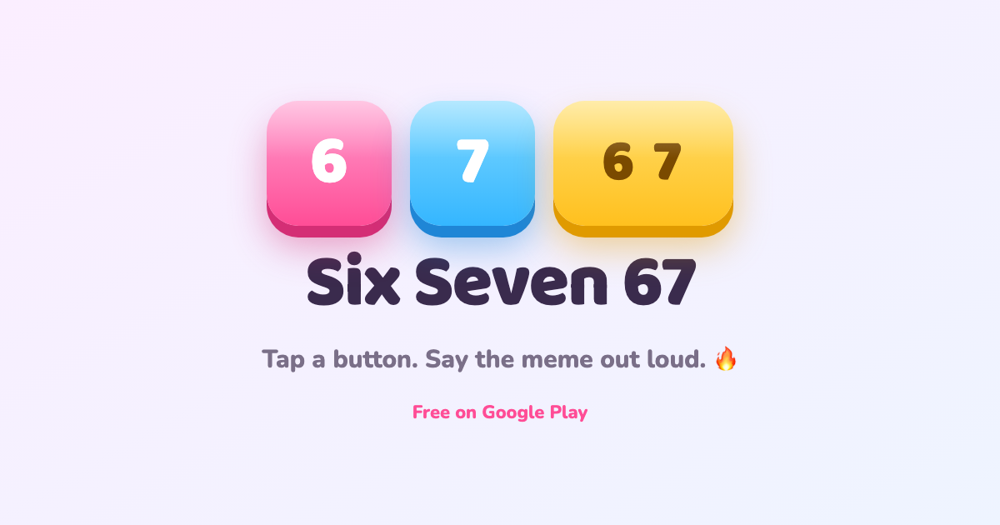

# Six Seven 67 — landing page

The web landing page for **Six Seven 67**, a tap-the-meme soundboard: three big buttons —
**6**, **7**, **6 7** — that say the number out loud in silly voices.

🔗 **Live:** <https://kotensky.github.io/share-six-seven/>
📱 **Get the app:** [Google Play](https://play.google.com/store/apps/details?id=com.mbro.sixseven) · iOS coming soon



## What it does

A single, self-contained page that:

- shows the app's signature 3D candy buttons — **tap one and it says the meme**;
- routes visitors the right way — **Android → Google Play**, **iOS → “coming soon”**;
- keeps the meme energy with an emoji burst on every tap.

No build step, no framework, no dependencies — just one `index.html` with inline CSS and JS.

## Run locally

Open `index.html` in a browser, or serve the folder:

```sh
python3 -m http.server 8000
# → http://localhost:8000
```

## Files

| File | What it is |
|---|---|
| `index.html` | the entire page (inline CSS/JS) |
| `six.mp3` · `seven.mp3` · `six_seven.mp3` | button voices, played on tap |
| `og.png` | 1200×630 social share card |
| `og.html` | source used to render `og.png` (headless Chrome) |

## Hosting

Served from GitHub Pages — *Settings → Pages → Deploy from a branch → `main` / root*.
Push to `main` to publish an update.

---

© 2026 Six Seven 67. The app, artwork, and voice clips belong to the author — please don't reuse the audio.
